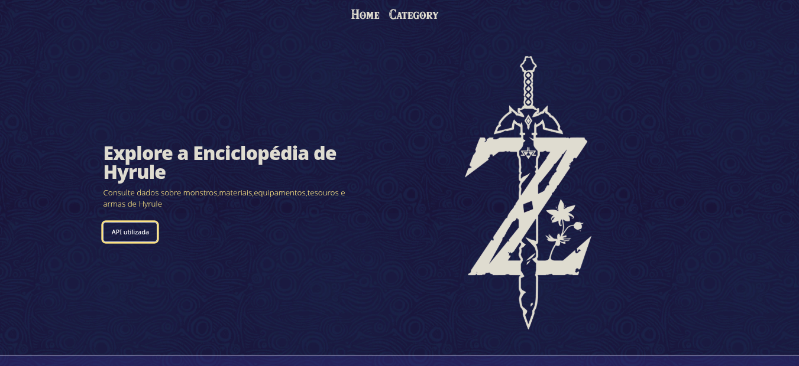
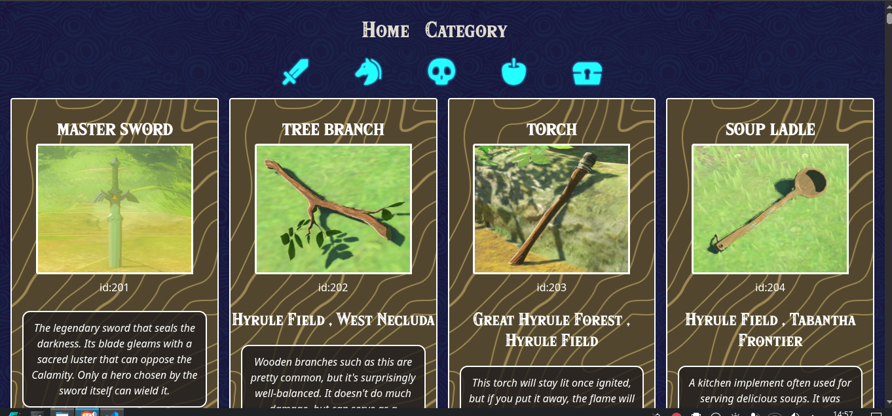

<h1>Enciclopédia de <strong>The Legend Of Zelda: BOTW</strong></h1>

<h2>Sobre o projeto ⚔️</h2>

<p>Este projeto teve como foco o aprendizado em consumo de API para criação de uma aplicação, a ideia foi criar uma Enciclopédia para o jogo The Legend Of Zelda: Breath of the Wild para que jogadores possam ter rápido acesso a informações do jogo.</p>

<p>A API utilizada foi a <a href="https://gadhagod.github.io/Hyrule-Compendium-API/#/">Hyrule Compendium API</a></p>

<h2>Tecnologias utilizadas: </h2>
<div style="display: inline">
  
  
  
  
</div>

<h2>Página Home</h2>
</img>

<h2>Página Category</h2>
</img>

<h1>Como executar o projeto</h1>
<p>Passo 1: Use o git clone em alguma pasta do seu computador para ter o projeto</p>

```
git clone https://github.com/Alison-de-Oliveira/KizaThon-Front-End.git
```

<p>Passo 2: Instale as dependências do projeto</p>

```
npm install
```

<p>Passo 3: Execute o projeto pelo terminal</p>

```
npm run dev
```

<h1>Contribuidores</h1>
<table>
  <tr>
      <td align="center"><a  href="https://github.com/Alison-de-Oliveira"><br /><sub><b>Alison de Oliveira</b></sub></a></td>
      <td align="center"><a  href="https://github.com/PabloK-DEV"><br /><sub><b>PabloK-Dev</b></sub></a></td>
      <td align="center"><a  href="https://github.com/AlanSCorreia"><br /><sub><b>AlanSCorreia</b></sub></a></td>
      <td align="center"><a  href="https://github.com/JosueFS"><br /><sub><b>Josué FS</b></sub></a></td>

  </tr>
</table>
